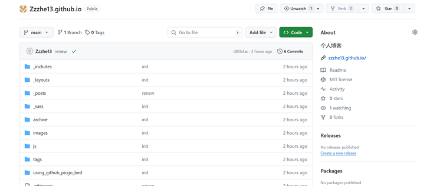
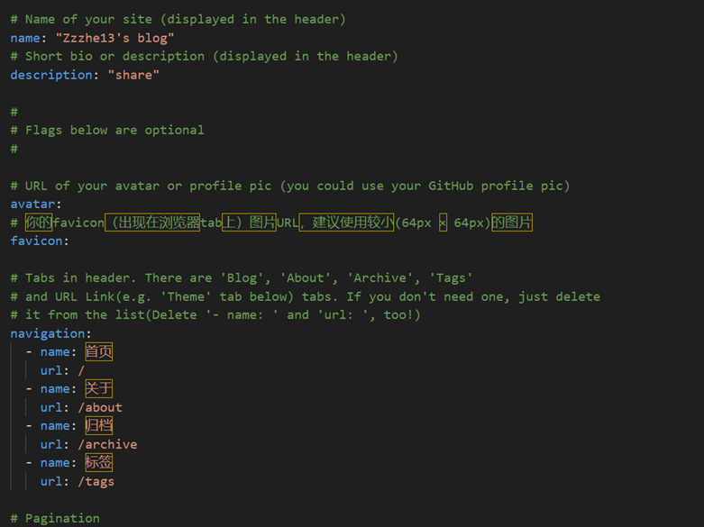

山东大学  计算机科学与技术  学院

  云计算技术  课程实验报告

 

| 学号：                 | 姓名            | 班级 |
| ------------------------------------------------------------ | --------------- | ---- |
| 实验题目：利用主流云平台搭建个人博客或网站                   |||
| 实验学时：2                                                  | 实验日期： 3.22 |      |
| 实验目的：熟悉使用主流云平台并搭建个人博客或者网站。  具体包括：  参考方案：基于主流云平台，设计、实现个人博客或者网站的搭建，撰写实验报告（附带网站链接并可以访问），并在网站上呈现此次实验报告。 |                 |      |
| 硬件环境：   联网的计算机一台                                |                 |      |
| 软件环境：  Windows or Linux                                 |                 |      |
| 实验步骤与内容：     第一步，建立Github仓库 |||
|     |||
|第二步，设置仓库开启Github Pages  |||
|第三步，使用Github内置主题  |||
|第四步，jekyll的目录结构   |||
|第五步，jekyll的模板编程语言Liquid的使用   |||
|第六步，使用_config.yml文件设置jekyll   |||
|     |||
|第七步，_layouts模板配置  |||
|第八步，md和html页面编写 |||
|第九步，博客文章编写和管理 |||
|链接  [zzzhe13.github.io/](https://zzzhe13.github.io/) |                 ||
|结论分析与体会：|||
|（1）熟悉了主流云平台的注册、创建实例或容器、配置域名等基本操作。|||
|（2）学会了使用网站搭建工具或框架来设计和实现个人博客或网站。|||
|（3）通过撰写实验报告并将其展示在搭建的网站上，提高了自己的写作能力和展示能力。|||
|（4）通过搭建个人博客或网站，分享自己的知识和经验，建立了个人品牌或展示自己的作品。|||
| (5) GitHub Pages提供了简便的静态网站托管服务，在一定程度上方便了网站的搭建和发布过程。使用Markdown编写实验报告并将其发布到网站上，使得报告可以更便捷地与他人分享。这次实验增强了对GitHub Pages的应用能力，也提升了对静态网站生成器的实际操作技能。 |||